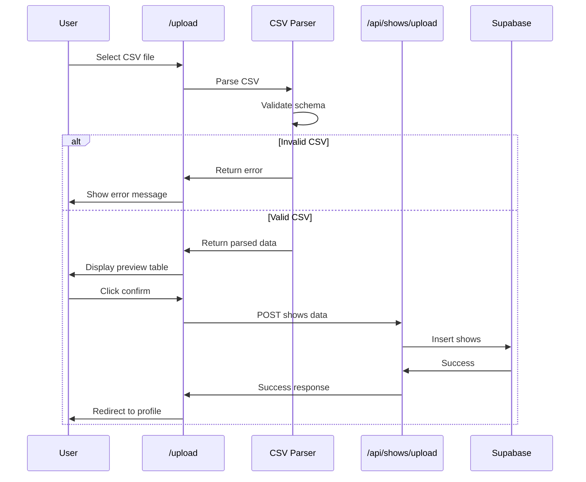

# CSV Upload Flow Implementation

## Database Setup

### Supabase Infrastructure (Terraform)

- Add Supabase Terraform provider to `[infra/main.tf](infra/main.tf)`
- Create Supabase organization and project resources
- Configure database schema via Terraform (or SQL migrations)
- Add Supabase connection environment variables to Vercel project
- Update `[infra/terraform.tfvars.example](infra/terraform.tfvars.example)` with Supabase variable placeholders
- Update `[infra/variables.tf](infra/variables.tf)` with Supabase variable definitions

### Database Schema

Create `shows` table with columns:

- `id` (uuid, primary key)
- `clerk_user_id` (text, indexed) - links show to user
- `date` (date) - show date in MM-DD-YY format
- `artists` (text[] or jsonb) - array of artist names
- `venue` (text, nullable)
- `city` (text, nullable)
- `state` (text, nullable)
- `country` (text, nullable)
- `created_at` (timestamp)
- `updated_at` (timestamp)

Add Row Level Security (RLS) policies:

- Users can only read/write their own shows (WHERE `clerk_user_id` = auth user)

### Local Development Setup

- Install `@supabase/supabase-js` package
- Create Supabase client utility at `[app/lib/supabase/client.ts](app/lib/supabase/client.ts)`
- Create Supabase server client utility at `[app/lib/supabase/server.ts](app/lib/supabase/server.ts)`
- Add Supabase environment variables to `[app/.env.example](app/.env.example)`:
  - `NEXT_PUBLIC_SUPABASE_URL`
  - `NEXT_PUBLIC_SUPABASE_ANON_KEY`
- Update `[DEVELOPMENT.md](DEVELOPMENT.md)` with instructions for:
  - Setting up local Supabase (via Supabase CLI or dev instance)
  - Running database migrations
  - Getting Supabase credentials

## TypeScript Types

Create `[app/types/show.ts](app/types/show.ts)` with interfaces:

- `Show` - database schema type
- `CSVRow` - raw CSV row type
- `ParsedCSVData` - parsed and validated CSV data

## CSV Upload Page

### Upload Route (`[app/app/upload/page.tsx](app/app/upload/page.tsx)`)

Create protected route with:

- File input for CSV upload
- CSV validation and parsing (client-side)
- Error messages for invalid CSV format
- Data preview table showing parsed rows
- Confirm/Submit button to save to database

### CSV Parsing Logic (`[app/lib/csv-parser.ts](app/lib/csv-parser.ts)`)

Implement functions:

- `parseCSV(file: File): Promise<CSVRow[]>` - parse CSV file
- `validateCSVSchema(rows: CSVRow[]): ValidationResult` - validate headers and required fields
- `parseDate(dateString: string): Date` - parse MM-DD-YY format
- `parseArtists(artistString: string): string[]` - split on '+' separator
- `transformCSVToShows(rows: CSVRow[], userId: string): Show[]` - transform CSV rows to Show objects

**Validation Rules:**

- Required headers: `date`, `artist`, `venue`, `city`, `state`, `country`
- Required fields per row: `date` and `artist` must not be empty
- Date format: MM-DD-YY (basic validation, accept valid dates)
- Artists: split on '+', trim whitespace
- Reject CSV if validation fails with clear error message

### Upload API Route (`[app/app/api/shows/upload/route.ts](app/app/api/shows/upload/route.ts)`)

Create POST endpoint to:

- Verify user authentication (get Clerk user ID)
- Receive array of Show objects from client
- Insert shows into Supabase `shows` table
- Return success/error response

## User Profile Updates

### Update User Profile Page (`[app/app/user/[username]/page.tsx](app/app/user/[username]/page.tsx)`)

Enhance to:

- Query Supabase for user's shows (by clerk_user_id)
- Display shows in a table if user has shows
- Show "Import show data" link/button if user has no shows (links to `/upload`)
- Format table with monospace typography per design guidelines
- Use borders/lines to separate table sections

### Shows Table Component (`[app/components/ShowsTable.tsx](app/components/ShowsTable.tsx)`)

Create reusable component to display shows:

- Columns: Date, Artists, Venue, City, State, Country
- Monospace typography
- Clean borders per DESIGN.md guidelines
- Handle multiple artists display (comma-separated or each on new line)
- Sort by date (most recent first)

## Data Flow Diagram




## Files to Create/Modify

**Create:**

- `app/lib/supabase/client.ts` - Supabase client
- `app/lib/supabase/server.ts` - Supabase server client
- `app/types/show.ts` - TypeScript types
- `app/lib/csv-parser.ts` - CSV parsing logic
- `app/app/upload/page.tsx` - Upload page
- `app/app/api/shows/upload/route.ts` - Upload API
- `app/components/ShowsTable.tsx` - Shows table component

**Modify:**

- `infra/main.tf` - Add Supabase resources
- `infra/variables.tf` - Add Supabase variables
- `infra/terraform.tfvars.example` - Add Supabase variable examples
- `app/.env.example` - Add Supabase env vars
- `app/package.json` - Add @supabase/supabase-js and CSV parsing library (papaparse)
- `app/app/user/[username]/page.tsx` - Add shows display and upload link
- `DEVELOPMENT.md` - Add Supabase local setup instructions

## Middleware Update

Update `[app/middleware.ts](app/middleware.ts)` to protect `/upload` route:

```typescript
const isProtectedRoute = createRouteMatcher(['/user(.*)', '/upload']);
```

## Testing Checklist

After implementation:

1. Test CSV upload with valid file
2. Test CSV upload with invalid file (missing headers, missing required fields)
3. Test date parsing with MM-DD-YY format
4. Test multi-artist parsing (with '+' separator)
5. Test shows display on user profile
6. Test that users can only see their own shows
7. Test redirect to /upload when user has no shows
8. Verify Terraform applies successfully for Supabase project
9. Verify local development setup instructions work

