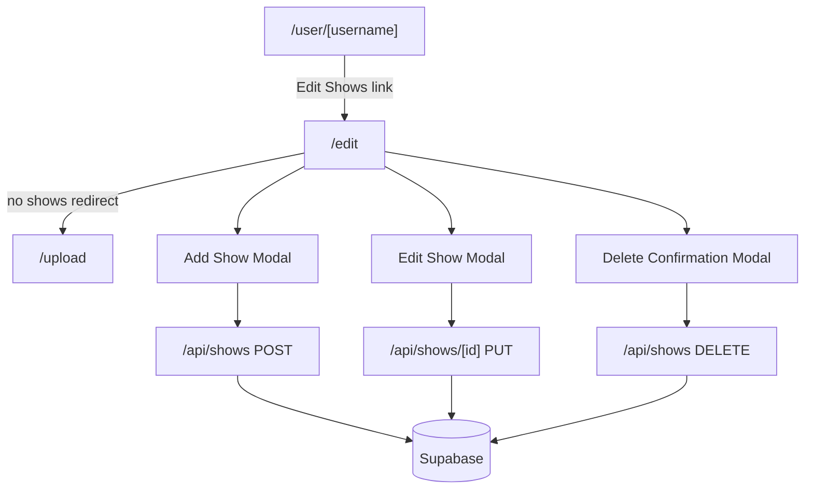

# Show List Edit Page Implementation

## Overview

Create an authenticated `/edit` page that allows users to manage their show collection with add, edit, and bulk delete functionality using modals and an interactive table.

## Architecture & Data Flow




## Key Design Decisions

**Route Structure:** `/edit` at root level (matching `/upload` pattern) with authentication required

**Table Interaction:** Modify existing `ShowsTable` component to accept `editable` prop that enables checkboxes and row click handlers

**Artist Management:** Dynamic list UI with add/remove buttons for each artist (more intuitive than text input with separators)

**Selection UI:** Checkboxes always visible in edit mode for easier bulk selection

**Modal Components:** Use shadcn/ui Dialog, Button, Input, and Label components for consistent styling

## Implementation Steps

### 1. Install Required shadcn/ui Components

Components needed:

- Dialog (for modals)
- Button (for actions)
- Input (for form fields)
- Label (for form labels)
- Checkbox (for row selection)

### 2. Create API Routes

**File: `[app/app/api/shows/route.ts](app/app/api/shows/route.ts)**` (NEW)

- `POST /api/shows` - Create single show
  - Auth: Verify `userId` from `auth()`
  - Validate: Ensure `date` and `artists[]` are present
  - Set `clerk_user_id` from authenticated user
  - Return created show with `id`

**File: `[app/app/api/shows/[id]/route.ts](app/app/api/shows/[id]/route.ts)**` (NEW)

- `PUT /api/shows/[id]` - Update show
  - Auth: Verify user owns the show (`clerk_user_id` matches)
  - Validate: Show exists
  - Update all fields: `date`, `artists`, `venue`, `city`, `state`, `country`
  - Return updated show
- `DELETE /api/shows/[id]` - Delete show
  - Auth: Verify user owns the show
  - Validate: Show exists
  - Delete from database
  - Return success

**File: `[app/app/api/shows/bulk-delete/route.ts](app/app/api/shows/bulk-delete/route.ts)**` (NEW)

- `POST /api/shows/bulk-delete` - Delete multiple shows
  - Body: `{ showIds: string[] }`
  - Auth: Verify all shows belong to authenticated user
  - Delete all in transaction
  - Return count of deleted shows

### 3. Update ShowsTable Component

**File: `[app/components/ShowsTable.tsx](app/components/ShowsTable.tsx)**`

Add props:

```typescript
interface ShowsTableProps {
  shows: Show[];
  editable?: boolean;
  selectedIds?: Set<string>;
  onRowClick?: (show: Show) => void;
  onSelectionChange?: (id: string, selected: boolean) => void;
}
```

When `editable={true}`:

- Add checkbox column as first column
- Make rows clickable (trigger `onRowClick`)
- Add hover styling for interactivity
- Maintain existing monospace, bordered design from `DESIGN.md`

### 4. Create Modal Components

**File: `[app/components/AddShowModal.tsx](app/components/AddShowModal.tsx)**` (NEW)

Form fields:

- Date (required, type="date")
- Artists (required, dynamic list with add/remove)
  - Initial: 1 empty artist input
  - "+ Add Artist" button
  - "X" remove button for each (except last if only one remains)
- Venue (optional)
- City (optional)
- State (optional)
- Country (optional)

Actions:

- "Cancel" - Close modal, discard changes
- "Add Show" - Validate, call `POST /api/shows`, refresh data, close modal

**File: `[app/components/EditShowModal.tsx](app/components/EditShowModal.tsx)**` (NEW)

Similar to AddShowModal but:

- Pre-populate with existing show data
- "Save" button instead of "Add Show"
- Call `PUT /api/shows/[id]`

**File: `[app/components/DeleteConfirmModal.tsx](app/components/DeleteConfirmModal.tsx)**` (NEW)

Display:

- Count of selected shows
- Warning message
- List of shows being deleted (date + artists)

Actions:

- "Cancel" - Close modal
- "Delete Shows" - Call bulk delete API, refresh data, close modal

### 5. Create Edit Page

**File: `[app/app/edit/page.tsx](app/app/edit/page.tsx)**` (NEW)

Server component that:

1. Gets authenticated user from Clerk `auth()`
2. If no user, redirect to sign-in
3. Fetch user's shows from Supabase
4. If no shows, redirect to `/upload`
5. Render client component with shows data

**File: `[app/app/edit/EditClient.tsx](app/app/edit/EditClient.tsx)**` (NEW)

Client component (`'use client'`) that:

- Manages state for:
  - Selected show IDs (Set)
  - Current modal (add/edit/delete/null)
  - Show being edited
  - Shows list (with optimistic updates)
- Renders:
  - Page header with "Edit Shows" title
  - "Add Show" button
  - "Delete Selected" button (disabled if none selected, shows count)
  - "Select All" / "Deselect All" button
  - `<ShowsTable editable={true} />` with selection handlers
  - Conditional modals based on state
- Handles:
  - Row clicks → open EditShowModal
  - Add button → open AddShowModal
  - Delete button → open DeleteConfirmModal
  - Checkbox changes → update selection state
  - API responses → refresh shows list

### 6. Update User Profile Page

**File: `[app/app/user/[username]/page.tsx](app/app/user/[username]/page.tsx)**`

When `isOwnProfile && userShows.length > 0`:

- Add "Edit Shows" link next to "Import More Shows" link
- Link to `/edit`
- Style consistently with existing link (maintain newspaper aesthetic)

### 7. Update Middleware

**File: `[app/middleware.ts](app/middleware.ts)**`

Add `/edit` to the protected routes matcher:

```typescript
const isProtectedRoute = createRouteMatcher(['/user(.*)', '/upload', '/edit']);
```

## Design Considerations

**Visual Style** (from `[DESIGN.md](DESIGN.md)`):

- Black text on white background
- Monospace typography for data
- Strategic use of borders (varying weights)
- Minimal color usage
- Clean, newspaper-like aesthetic

**Modal Styling:**

- Border: `border-2 border-black`
- Buttons: Simple borders, no rounded corners
- Forms: Monospace inputs, clear labels
- Maintain consistent spacing with rest of app

**Table Enhancements:**

- Checkbox column: Left-aligned, narrow
- Row hover: Subtle background change (e.g., `hover:bg-gray-50`)
- Selected rows: Slightly darker background
- Click cursor on editable rows

## Error Handling

- API errors: Show toast/alert with error message
- Validation errors: Show inline on form fields
- Network errors: Graceful degradation with retry option
- Empty states: Clear messaging

## Testing Considerations

Manual testing checklist:

1. Add show with single artist
2. Add show with multiple artists
3. Edit show details
4. Add/remove artists in edit modal
5. Delete single show
6. Delete multiple shows (bulk)
7. Select all / deselect all
8. Try to access `/edit` without shows (should redirect)
9. Try to access `/edit` without auth (should redirect to sign-in)
10. Verify only user's own shows are visible/editable

## Files Changed Summary

**New Files:**

- `app/app/api/shows/route.ts`
- `app/app/api/shows/[id]/route.ts`
- `app/app/api/shows/bulk-delete/route.ts`
- `app/app/edit/page.tsx`
- `app/app/edit/EditClient.tsx`
- `app/components/AddShowModal.tsx`
- `app/components/EditShowModal.tsx`
- `app/components/DeleteConfirmModal.tsx`
- `app/components/ui/dialog.tsx` (via shadcn)
- `app/components/ui/button.tsx` (via shadcn)
- `app/components/ui/input.tsx` (via shadcn)
- `app/components/ui/label.tsx` (via shadcn)
- `app/components/ui/checkbox.tsx` (via shadcn)

**Modified Files:**

- `app/components/ShowsTable.tsx`
- `app/app/user/[username]/page.tsx`
- `app/middleware.ts`

## Notes

- Show notes functionality (plan #7) is explicitly excluded from this implementation
- Artist input UI is more user-friendly than CSV's "+" separator approach
- Bulk delete uses separate endpoint for better transaction handling
- All modals use shadcn Dialog for consistency
- Auth checks happen at both route and API levels for security

