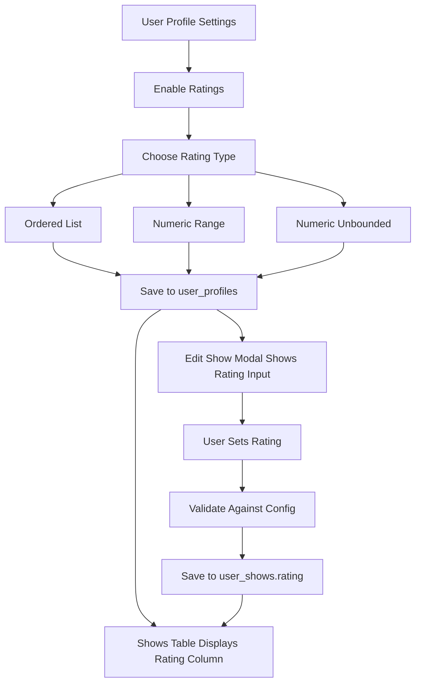

# Custom Rating System Implementation

## Overview

This plan implements a flexible rating system that allows users to:

- Configure custom rating schemes (ordered lists, numeric ranges, or unbounded scores)
- Enable/disable ratings on their profile
- Rate shows when ratings are enabled
- View ratings in the shows table (only when enabled)

## Database Schema Changes

### Migration 008: Add rating column to user_shows

Add a `rating` column to the `user_shows` table:

```sql
ALTER TABLE user_shows ADD COLUMN rating TEXT;
```

**Rationale:** TEXT type accommodates all rating types (strings like "AAA", numbers like "10", decimals like "8.5").

### Migration 009: Add rating configuration to user_profiles

Add rating system configuration columns to `user_profiles`:

```sql
ALTER TABLE user_profiles 
  ADD COLUMN ratings_enabled BOOLEAN DEFAULT FALSE,
  ADD COLUMN rating_system_type TEXT CHECK (rating_system_type IN ('ordered_list', 'numeric_range', 'numeric_unbounded')),
  ADD COLUMN rating_system_config JSONB;
```

**Rationale:**

- `ratings_enabled`: Toggle to show/hide ratings
- `rating_system_type`: Discriminator for the three rating types
- `rating_system_config`: Stores configuration (e.g., `{values: ["AAA","AA","A"], direction: "desc"}` or `{min: 1, max: 10, direction: "higher_is_better"}`)

## Type Definitions

### Update `app/types/database.ts`

Add new fields to `user_shows` and `user_profiles` table definitions:

```typescript
user_shows: {
  Row: {
    // ... existing fields
    rating: string | null;
  };
  // ... Update Insert/Update
}

user_profiles: {
  Row: {
    // ... existing fields
    ratings_enabled: boolean;
    rating_system_type: 'ordered_list' | 'numeric_range' | 'numeric_unbounded' | null;
    rating_system_config: RatingSystemConfig | null;
  };
  // ... Update Insert/Update
}
```

### Create `app/types/rating.ts`

Define rating system types:

```typescript
export type RatingSystemType = 'ordered_list' | 'numeric_range' | 'numeric_unbounded';

export interface OrderedListConfig {
  values: string[]; // e.g., ["AAA", "AA", "A", "B", "C"]
}

export interface NumericRangeConfig {
  min: number;
  max: number;
  direction: 'higher_is_better' | 'lower_is_better';
  allow_decimals?: boolean;
}

export interface NumericUnboundedConfig {
  direction: 'higher_is_better' | 'lower_is_better';
  allow_decimals?: boolean;
}

export type RatingSystemConfig = 
  | { type: 'ordered_list'; config: OrderedListConfig }
  | { type: 'numeric_range'; config: NumericRangeConfig }
  | { type: 'numeric_unbounded'; config: NumericUnboundedConfig };
```

## Backend: Rating System Configuration

### Update `app/api/profile/route.ts`

Add validation and handling for new rating system fields:

```typescript
// Accept ratings_enabled, rating_system_type, rating_system_config in POST body
// Validate that if ratings_enabled is true, rating_system_type and config must be provided
// Validate rating_system_config structure matches the type
```

### Create `app/lib/rating-validation.ts`

Utility functions for rating validation:

```typescript
export function validateRatingSystemConfig(type: RatingSystemType, config: any): boolean
export function validateRatingValue(value: string, systemConfig: RatingSystemConfig): boolean
export function getRatingDisplayValue(value: string, systemConfig: RatingSystemConfig): string
export function compareRatings(a: string, b: string, systemConfig: RatingSystemConfig): number
```

### Update `app/api/shows/route.ts` and `app/api/shows/[id]/route.ts`

- Accept optional `rating` field in POST (add) and PUT (edit)
- Validate rating value against user's rating system configuration
- Store rating in `user_shows.rating`

## Frontend: Rating Configuration UI

### Create `app/components/RatingSystemConfig.tsx`

A component for configuring rating systems with three tabs/sections:

1. **Ordered List**: Input for comma-separated values (e.g., "AAA,AA,A,B,C")
2. **Numeric Range**: Min/max inputs, radio for direction, checkbox for decimals
3. **Numeric Unbounded**: Radio for direction, checkbox for decimals

**UI Design:**

- Monospace font, border-box style consistent with existing design
- Clear validation messages (e.g., "Must provide at least 2 values")
- Preview showing example ratings

### Update `app/components/EditProfileModal.tsx`

Add a new section for rating system configuration:

```tsx
<div className="border-t border-black pt-4 space-y-4">
  <h3>Rating System</h3>
  <Checkbox 
    id="ratings-enabled"
    checked={ratingsEnabled}
    onCheckedChange={...}
  />
  <Label>Enable ratings for my shows</Label>
  
  {ratingsEnabled && (
    <RatingSystemConfig 
      type={ratingSystemType}
      config={ratingSystemConfig}
      onChange={...}
    />
  )}
</div>
```

**Placement:** After "Social Links" section, before footer buttons

## Frontend: Rating Display & Editing

### Update `app/components/ShowsTable.tsx`

Conditionally add Rating column when user has ratings enabled:

```tsx
// Accept new prop: ratingSystemConfig?: RatingSystemConfig | null
// If ratingSystemConfig exists, add Rating column BEFORE Notes column (after Country)
<th className="text-left p-3 border-r border-black">Rating</th>

// In row rendering:
<td className="p-3 border-r border-black">
  {show.rating || '-'}
</td>
```

**Column Order:** Date | Artists | Venue | City | State | Country | **Rating** | Notes

### Update `app/components/AddShowModal.tsx` and `app/components/EditShowModal.tsx`

Add optional rating input field **in the Edit Show modal only** (not inline in table):

```tsx
{ratingSystemEnabled && (
  <div>
    <Label htmlFor="rating">Rating (optional)</Label>
    <RatingInput 
      value={rating}
      config={ratingSystemConfig}
      onChange={setRating}
    />
  </div>
)}
```

**Rating Input Rendering:**

- **Ordered List**: Dropdown/select with configured values + "No rating" option
- **Numeric Range**: Number input with min/max/step based on config
- **Numeric Unbounded**: Number input with appropriate step

**Note:** Ratings are edited through the modal only, not inline in the table.

### Create `app/components/RatingInput.tsx`

Reusable component for rendering appropriate rating input based on system type:

```tsx
interface RatingInputProps {
  value: string | null;
  config: RatingSystemConfig;
  onChange: (value: string | null) => void;
}
```

## User Profile Display

### Update `app/app/user/[username]/page.tsx`

- Fetch user's rating system configuration along with profile
- Pass `ratingSystemConfig` to `ShowsTable` component
- Shows table will automatically display Rating column if config exists and `ratings_enabled` is true

### Update `app/app/edit/EditClient.tsx`

- Fetch current user's rating system configuration
- Pass to `ShowsTable`, `AddShowModal`, and `EditShowModal`

## Data Flow Summary




## Default Rating System

When users first enable ratings, default to a 5-star system:

- Type: `ordered_list`
- Values: `["*****", "****", "***", "**", "*"]`

This provides immediate usability without requiring configuration.

## Validation Rules

1. **Profile Level:**
  - If `ratings_enabled` is true, must have valid `rating_system_type` and `rating_system_config`
  - Config must match type (e.g., ordered_list requires `values` array with ≥2 items)
2. **Show Level:**
  - Rating value must be valid for user's rating system
  - For ordered_list: value must be in the configured list
  - For numeric_range: value must be between min and max
  - For numeric_unbounded: value must be a valid number (with/without decimals based on config)
  - Empty/null rating is always valid (ratings are optional)

## CSV Upload Considerations

The existing CSV upload functionality should:

- Allow optional `rating` column in CSV
- Validate ratings against user's rating system
- Provide clear error messages for invalid ratings
- Continue uploading rows with valid ratings, skip/report rows with invalid ratings

Update `[app/api/shows/upload-with-progress/route.ts](app/api/shows/upload-with-progress/route.ts)` to handle rating column.

## Testing Considerations

After implementation, test:

1. Creating profiles with each rating system type
2. Adding shows with ratings
3. Editing ratings on existing shows
4. Disabling ratings (column disappears)
5. Changing rating system type (existing ratings remain, may become invalid)
6. CSV upload with ratings
7. Public profile view (ratings visible to others)
8. Sorting by rating (future enhancement consideration)

## Future Enhancements

Consider for future iterations:

- Sort shows table by rating
- Filter shows by rating range
- Rating statistics on profile (average, distribution)
- Bulk rating operations
- Rating history/changes over time
- Import ratings from CSV with type conversion

