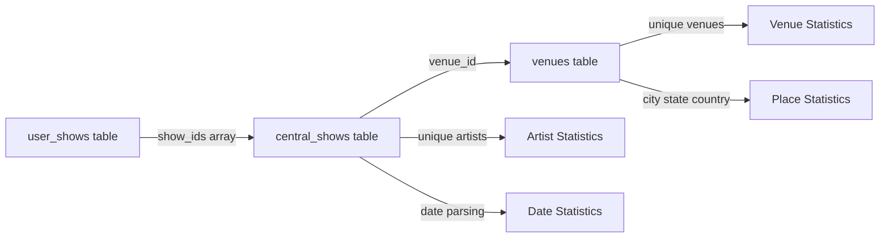

# Implement Basic Show Statistics

## Overview

Add comprehensive statistics display and navigation for user show data. This includes basic aggregate stats on the main profile page and four dedicated statistics pages with detailed breakdowns.

## Data Architecture

### Statistics Calculation Rules

All statistics are computed from the `user_shows` table with joins to `central_shows`:

- **Show count**: Count of `user_shows` rows (one entry = one show)
- **Artist count**: Count of unique artists across all `central_shows` referenced by `show_ids`
  - Multi-artist shows (e.g., "Umphrey's McGee + Goose") count toward each artist
- **Venue/City/State/Country counts**: Count unique values from `venues` table via `central_shows`
- **Missing location data**: Ignore null/missing values (don't display zeros or messages)

### Data Flow




## Implementation Plan

### 1. Basic Stats Display on Profile Page

**File**: `[app/app/user/[username]/page.tsx](app/app/user/[username]/page.tsx)`

Add statistics calculation after fetching `transformedShows`:

```typescript
// Calculate basic statistics
const stats = {
  totalShows: transformedShows.length,
  uniqueArtists: new Set(transformedShows.flatMap(s => s.shows.map(cs => cs.artist))).size,
  uniqueVenues: new Set(transformedShows.flatMap(s => s.shows.map(cs => cs.venue?.name).filter(Boolean))).size,
  uniqueCities: new Set(transformedShows.flatMap(s => s.shows.map(cs => cs.venue?.city).filter(Boolean))).size,
  uniqueStates: new Set(transformedShows.flatMap(s => s.shows.map(cs => cs.venue?.state).filter(Boolean))).size,
  uniqueCountries: new Set(transformedShows.flatMap(s => s.shows.map(cs => cs.venue?.country).filter(Boolean))).size,
};
```

**New Component**: `app/components/BasicStats.tsx`

Create a simple component matching the monospace, newspaper aesthetic:

```typescript
interface BasicStatsProps {
  totalShows: number;
  uniqueArtists: number;
  uniqueVenues: number;
  uniqueCities: number;
  uniqueStates: number;
  uniqueCountries: number;
}

export default function BasicStats({ ... }: BasicStatsProps) {
  return (
    <div className="border border-black p-4 mb-4 font-mono text-sm">
      <div className="flex flex-wrap gap-x-6 gap-y-2">
        <span>{totalShows} shows</span>
        <span className="text-gray-400">|</span>
        <span>{uniqueArtists} artists</span>
        <span className="text-gray-400">|</span>
        <span>{uniqueVenues} venues</span>
        <span className="text-gray-400">|</span>
        <span>{uniqueCities} cities</span>
        {uniqueStates > 0 && (
          <>
            <span className="text-gray-400">|</span>
            <span>{uniqueStates} states</span>
          </>
        )}
        {uniqueCountries > 0 && (
          <>
            <span className="text-gray-400">|</span>
            <span>{uniqueCountries} countries</span>
          </>
        )}
      </div>
    </div>
  );
}
```

Position: Between the `UserProfileSection` and the edit buttons/`ShowsTable`.

### 2. Stats Navigation Links

**File**: `[app/app/user/[username]/page.tsx](app/app/user/[username]/page.tsx)`

Add navigation links below basic stats (above edit buttons when present):

```typescript
<div className="mb-4 flex gap-4 font-mono text-sm">
  <Link href={`/user/${username}/stats/artists`} className="underline hover:no-underline">
    Artist Stats
  </Link>
  <Link href={`/user/${username}/stats/venues`} className="underline hover:no-underline">
    Venue Stats
  </Link>
  <Link href={`/user/${username}/stats/places`} className="underline hover:no-underline">
    Place Stats
  </Link>
  <Link href={`/user/${username}/stats/dates`} className="underline hover:no-underline">
    Date Stats
  </Link>
</div>
```

### 3. Artist Statistics Page

**File**: `app/app/user/[username]/stats/artists/page.tsx`

- Fetch `user_shows` and join with `central_shows`
- Group by artist name
- Count occurrences per artist
- Sort descending by count
- Display in a table matching `ShowsTable` styling

Table structure:

- Column 1: Artist name
- Column 2: Show count

### 4. Venue Statistics Page

**File**: `app/app/user/[username]/stats/venues/page.tsx`

- Fetch `user_shows` → `central_shows` → `venues`
- Group by venue name (include city for disambiguation)
- Count occurrences per venue
- Sort descending by count
- Display in a table

Table structure:

- Column 1: Venue name
- Column 2: City (for context)
- Column 3: Show count

### 5. Place Statistics Page

**File**: `app/app/user/[username]/stats/places/page.tsx`

Three separate tables on one page:

**Cities Table**

- Group by city name
- Count shows per city
- Sort descending

**States Table** (if any state data exists)

- Group by state
- Count shows per state
- Sort descending

**Countries Table** (if any country data exists)

- Group by country
- Count shows per country
- Sort descending

Table structure for each:

- Column 1: Place name
- Column 2: Show count

### 6. Date Statistics Page

**File**: `app/app/user/[username]/stats/dates/page.tsx`

Three separate tables on one page:

**Years Table**

- Extract year from `central_shows.date`
- Count shows per year
- Sort descending by year

**Months Table**

- Extract month from dates (across all years)
- Count shows per month (January, February, etc.)
- Display in calendar order (January first)

**Days of Week Table**

- Extract day of week from dates
- Count shows per day
- Display in week order (Sunday/Monday first)

Table structure for each:

- Column 1: Time period (year/month name/day name)
- Column 2: Show count

### 7. Shared Table Component

**File**: `app/components/StatsTable.tsx`

Create a reusable table component matching `ShowsTable` aesthetic:

```typescript
interface StatsTableProps {
  title: string;
  headers: string[];
  rows: (string | number)[][];
}

export default function StatsTable({ title, headers, rows }: StatsTableProps) {
  return (
    <div className="mb-8">
      <h2 className="text-lg font-bold font-mono mb-3">{title}</h2>
      <div className="w-full border border-black">
        <table className="w-full font-mono text-sm">
          <thead>
            <tr className="border-b-2 border-black">
              {headers.map((header, i) => (
                <th key={i} className={`text-left p-3 ${i < headers.length - 1 ? 'border-r border-black' : ''}`}>
                  {header}
                </th>
              ))}
            </tr>
          </thead>
          <tbody>
            {rows.map((row, i) => (
              <tr key={i} className="border-b border-black last:border-b-0">
                {row.map((cell, j) => (
                  <td key={j} className={`p-3 ${j < row.length - 1 ? 'border-r border-black' : ''}`}>
                    {cell}
                  </td>
                ))}
              </tr>
            ))}
          </tbody>
        </table>
      </div>
    </div>
  );
}
```

### 8. Shared Stats Layout

**File**: `app/app/user/[username]/stats/layout.tsx`

Create a layout with:

- Username/breadcrumb at top
- Back link to main profile
- Consistent styling across all stats pages

## Technical Details

### Data Aggregation Strategy

All stats pages will:

1. Fetch user's `clerk_user_id` from username (via Clerk API)
2. Fetch all `user_shows` for that user
3. For each `user_shows` row, fetch related `central_shows` with venue data
4. Perform aggregation in TypeScript (no database aggregation queries initially)
5. Sort and format results for display

This approach reuses existing data fetching patterns from the profile page.

### Performance Considerations

- Stats pages are server-side rendered (Next.js server components)
- Each page independently fetches data (separate routes)
- Stats are calculated on-demand (no caching initially)
- For users with hundreds of shows, aggregation should complete in <500ms

### Edge Cases

- **No data**: Display empty table with headers
- **Missing location fields**: Ignore/filter out null values
- **Multi-artist shows**: Each artist counted separately for artist stats, but single show for all other stats
- **Same venue different cities**: Treated as separate venues (should not happen in practice with normalized venues table)

## Files to Create/Modify

**Create**:

- `app/components/BasicStats.tsx`
- `app/components/StatsTable.tsx`
- `app/app/user/[username]/stats/layout.tsx`
- `app/app/user/[username]/stats/artists/page.tsx`
- `app/app/user/[username]/stats/venues/page.tsx`
- `app/app/user/[username]/stats/places/page.tsx`
- `app/app/user/[username]/stats/dates/page.tsx`

**Modify**:

- `app/app/user/[username]/page.tsx` (add basic stats display and navigation links)

## Success Criteria

- ✓ Basic stats display on profile page with accurate counts
- ✓ Navigation links to all four stats pages
- ✓ Artist stats page showing count per artist
- ✓ Venue stats page showing count per venue with city
- ✓ Place stats page with three tables (cities/states/countries)
- ✓ Date stats page with three tables (years/months/days)
- ✓ All tables match the monospace, newspaper aesthetic
- ✓ Multi-artist shows correctly contribute to artist counts
- ✓ Missing location data is ignored gracefully

